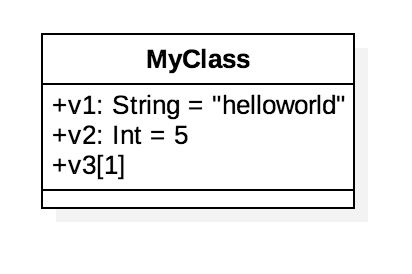
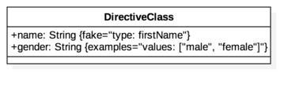
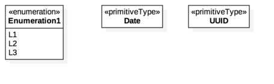
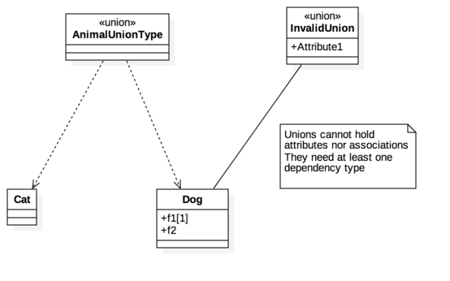
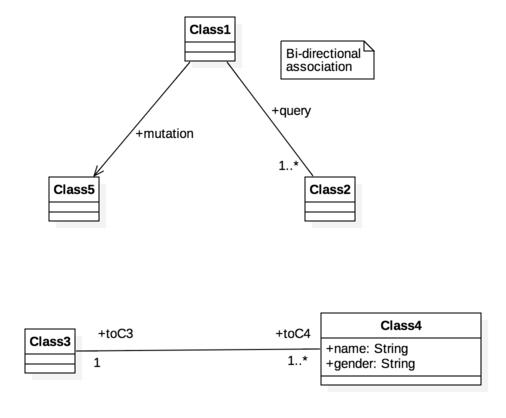
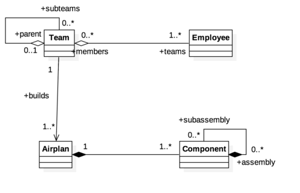
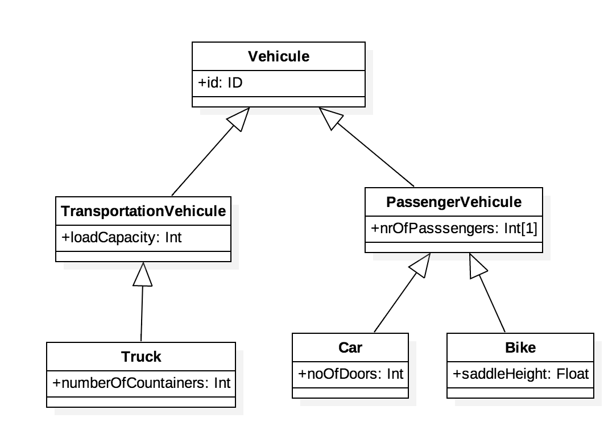
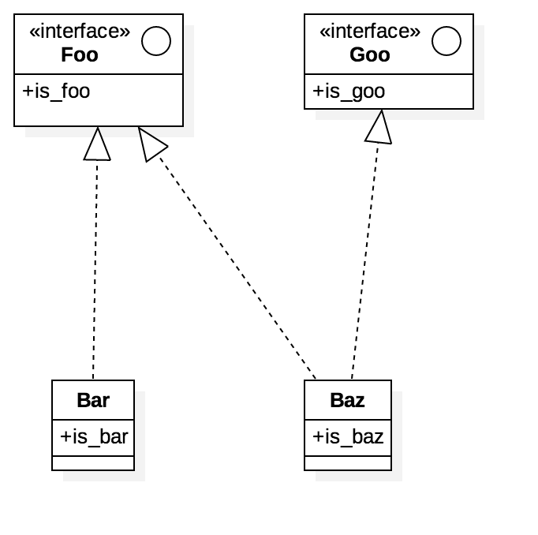
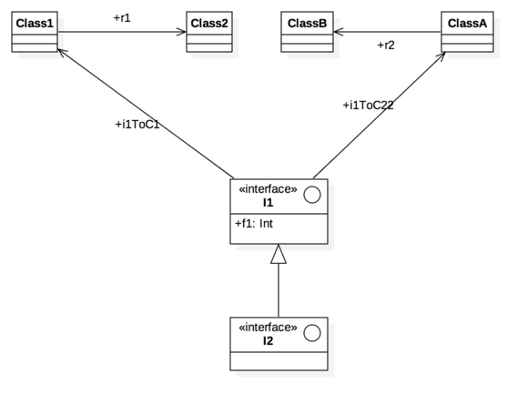
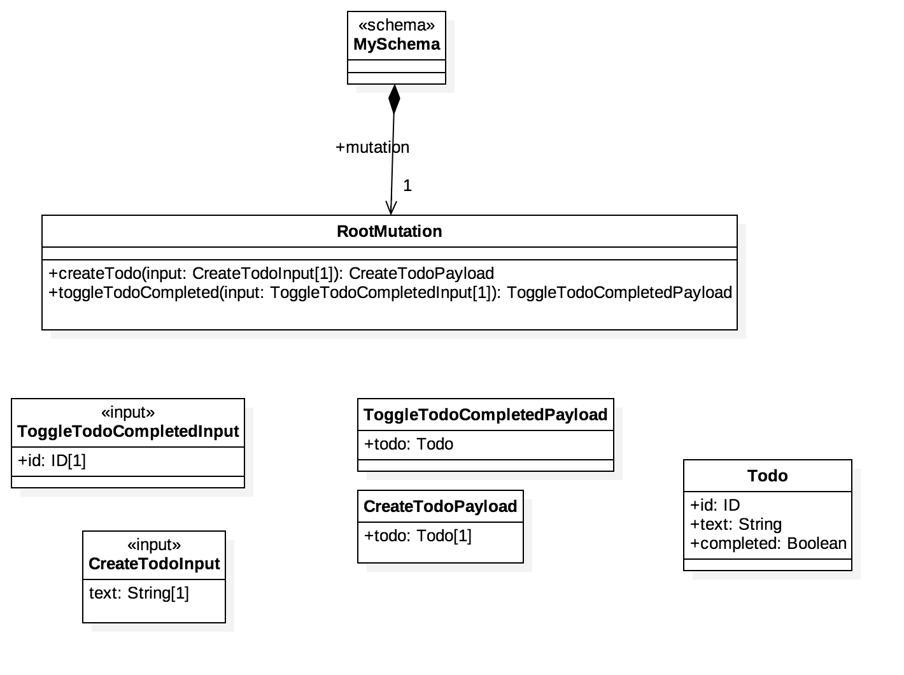

GraphQL Extension for StarUML 2
============================

[](https://www.paypal.com/cgi-bin/webscr?cmd=_s-xclick&hosted_button_id=N7GUM99ZAU738)

This extension for StarUML(http://staruml.io) supports the generation of GraphQL IDL schemas from UML models. 

What's new
----
* **New Feature:** Give great flexibility to your diagram but using Abstract classes. Abstract classes keept their full meaning in a class hierachy, but are not generated.
* **New Feature:** Allow graphQL generation in a ui panel
* **New Feature:** You may now generate from the top project level
* **New Feature:** Added graphql file generation from context menu (right click on element)
* **New Feature:** Generated filename is now based from the picked element
* **New Feature:** Added a preference to control debug output
* **New Feature:** Unnamed associations are given a more meaningful name based on the entities they link. They are also pluralized when applicable
* **New Feature:** Attribute/Realtionship naming overrides are now properly implemented between attribute types , associations and hierarchies
* **Bug:** Default parameter value wasn't generated for mutators
* **Bug:** Removed _(c)copyright_ from preferences as this information is redundant with Project.copyright
* **Bug:** Cardinality generation was off
* **Extra:** Added a few more examples

Installation
------------
Install this extension from StarUML's Extension Manager.

Usage
-----
1. Click the menu (`Tools > GraphQL > Generate Code...`)
2. Select a base model (or package) that will be generated to GraphQL.
3. Select a folder where generated GraphQL source files will be placed.

 file **schema.gql** will be generated at destination

Generation
----------

**Disclaimer:** Neither StarUML nor this generator can enforce the limitations governed by the GraphQL expression language. It is of your responsibility to create data structures that will comply with the GraphQL specifications.

### GraphQL IDL Notation

Let's start with the basics.


###Classes, Default values & Directives

So let's start with a basic class generation.
Here class attributes are given a type and a default value. We also made v3 a required field. Finally we added documentation here and there to demo what the generator does.



```
# name: GraphQL Generation Samples
# version: 1.0
# author Olivier Refalo
# copyright (c) Olivier Refalo

# Just a few comments to demo documentation generation.
type MyClass {

    v1: String="helloworld"
    v2: Int=5
    # This field is required, it has a multiplicity=1
    v3: String!
}
```



GraphQL offers a great way to implement custom behaviors using @directives. Using StarUML than can be modelled as Tags (if they need to be visually visible) or constraints. In the sample below, @const1 is not "visible"

```
type DirectiveClass {
    name: String @fake(type: firstName) @const1(value1)
    gender: String @examples(values: ["male", "female"])
}
```


### Scalars & Enums

Scalars and Enumerations are supported by StarUML's native _Primitive_ and _Enumeration_ types. Please ensure you use these native StarUML types in order to generate the expected artifacts.



```
scalar UUID
scalar Date

enum Enumeration1 {
    L1
    L2
    L3
}
```


### Union types

Union types are defined by using _Dependencies_. Typically Unions do not carry any attributes or relations. The generator will warn when it encounters such structure.



```
type Cat {

}

# test class doc
type Dog {

    f1: String!
    # test field doc
    f2: String
    toInvalidUnion: InvalidUnion
}

union AnimalUnionType = Cat | Dog

# WARNING: Attributes on union types is not GraphQL compliant, ignoring.
```

### Associations, Aggregation & Composition

Important facts, associations are:

* directional
* multiplicity aware
* automatically named, unless specified (either on each end, or on association itself)



```
type Class3 {

    toC4: [Class4]!
}

type Class4 {

    name: String
    gender: String
    toC3: Class3!
}

type Class1 {

    query: [Class2]!
    mutation: Class5
}

type Class2 {

    query: Class1
}

type Class5 {

}
```



```
type Team {

    subteams: [Team]
    parent: Team
    builds: [Airplan]!
    teams: [Employee]!
}

type Airplan {

    toComponent: [Component]!
}

type Employee {

    members: [Team]
}

type Component {

    toAirplan: Airplan!
    subassembly: [Component]
    assembly: [Component]
}
```

### Class and Interface hierarchies

Unlike GraphQL syntax, there is no need to repeat the attribute definition across the hierarchy. The generator takes care of it, Neat!



```
type Vehicule {

    id: ID
}

type Car extends PassengerVehicule {

    noOfDoors: Int
    nrOfPasssengers: Int!
    id: ID
}

type Truck extends TransportationVehicule {

    numberOfCountainers: Int
    loadCapacity: Int
    id: ID
}

type TransportationVehicule extends Vehicule {

    loadCapacity: Int
    id: ID
}

type PassengerVehicule extends Vehicule {

    nrOfPasssengers: Int!
    id: ID
}

type Bike extends PassengerVehicule {

    saddleHeight: Float
    nrOfPasssengers: Int!
    id: ID
}

```



Here we use InterfaceRealization to implement an interface in a new class. Note how the child attributes are automatically inherited from the parent interface.

```
type Bar implements Foo {

    is_bar: String
    is_foo: String
}

type Baz implements Foo, Goo {

    is_baz: String
    is_foo: String
    is_goo: String
}

interface Foo {

    is_foo: String
}

interface Goo {

    is_goo: String
}
```



Finally a example showing interface extension.

```
type Class1 {

    r1: Class2
}

type Class2 {

}

type ClassB {

}

type ClassA {

    r2: ClassB
}

interface I1 {

    f1: Int
    i1ToC22: ClassA
    i1ToC1: Class1
}

interface I2 extends I1 {

    f1: Int
    i1ToC22: ClassA
    i1ToC1: Class1
}
```


###Schemas, Mutations



```
type RootMutation {

    createTodo(input: CreateTodoInput!) :  CreateTodoPayload

    toggleTodoCompleted(input: ToggleTodoCompletedInput!) :  ToggleTodoCompletedPayload

}

schema {
    mutation: RootMutation!
}

# `id` is generated by the backend, and `completed` is automatically set to false
input CreateTodoInput {

    text: String!
}

type Todo {

    id: ID
    text: String
    completed: Boolean
}

type CreateTodoPayload {

    todo: Todo!
}

input ToggleTodoCompletedInput {

    id: ID!
}

type ToggleTodoCompletedPayload {

    todo: Todo
}

```


Rules
--------------------
The following rules apply during generation.

### Project Metadata

* _name_, _company_, _version_, _author_ and _copyright_ are used to generate the document header.

### UMLPackage

* ignored - but browsed recursively for other uml entities.

### UMLPrimaryType

* converted to _GraphQL scalar_.

### UMLClass

* converted to _GraphQL type_.
* Abstract class are not generated, but still part of the hierarchy.
* `union` stereotype converted to an *union* type, using dependency connections to related types.
* `input` stereotype converted to an *input* type.
* `schema` stereotype converted to a GraphQL *schema*.
* Full support for UML inheritance and interface - no need to repeat attributes across the hierarchy.
* Documentation property to GraphQL comment.

### UMLAttribute

* converted to _GraphQL Field_.
* `name` property to field identifier.
* `type` property to field type, defaults to String.
* `multiplicity` property to array type and/or required constraint.
* GraphQL directives implemented via attribute's Tag(name, value) 
* GraphQL directives can also be modeled via an attribute Constraint(name, specification) - in which case they will not display in the diagram
* Default values generation.
* Documentation property to GraphQL comment.

### UMLOperation

* converted to _GraphQL mutator_.
* `name` property to method identifier.
* _UMLParameter_ to _GraphQL Method Parameters_.
* _UMLParameter_'s name property to parameter identifier.
* _UMLParameter_'s type property to type of parameter.
* _UMLParameter_'s `multiplicity` property to array type and/or required constraint.
* _UMLParameter_ with `direction` = `return` to return type of method.
* GraphQL directives implemented via attribute's Tag(name, value) 
* GraphQL directives can also be modeled via an attribute Constraint(name, specification) - in which case they will not display in the diagram
* Documentation property to GraphQL comment.

### UMLInterface

* converted to _GraphQL Interface_.  (as a separate `.ts` file)
* Documentation property to GraphQL comment.

### UMLEnumeration

* converted to _GraphQL enum_.
* _UMLEnumerationLiteral_ to literals of enum.

### UMLAssociationEnd

* support for associations, aggregations and compositions
* be careful, by default starUML create bi-directional associations(like) relations. Use the "navigable" flag to pick on which side the accessor should be generated.
* converted to _GraphQL Field_.
* `name` property to field identifier.
* `type` property to field type.
* Documentation property to GraphQL comment.
* `multiplicity` property to array type and required constraint.

| Cardinality property| => Generation |
| ------------------- |--------------|
|       0..1          |        field |
|       1             |       field! |
|       n   n>1       |     [field!] |
|       0..* or *     |      [field] |
|       1..*          |     [field!] |

### UMLGeneralization

* converted to _GraphQL extends_ or _GraphQL implements_.
* Allowed only for _UMLClass_ to _UMLClass_, and _UMLInterface_ to _UMLInterface_.

### UMLInterfaceRealization

* converted to _GraphQL Implements_.
* Allowed only for _UMLClass_ to _UMLInterface_.

FAQ
----

### How to create comments?
Ensure Preference's option is turned on, use starUML documentation area. The generator will pick it up.

### How to create a union?
A Union is a class with a _union_ stereotype, types are referenced via a **Dependency** relationship

### How do I get a schema.json from the IDL file?

Use _gqlschema_ from npm's [gql-tools](https://www.npmjs.com/package/gql-tools)

### I can't see Interface's attributes in diagrams
That StartUML default interface rendering. Right click on the interface, from the context menu, pick `Format > Stereotype display > Decorations and labels`

### How to make an attribute _required_?
1. Select the attribute, the parameter or the relationship
2. Depending on what you want to make 'required', use one of the multiplicity below

| Cardinality property| => Generation |
| ------------------- |--------------|
|       1             |       field! |
|       n   n>1       |     [field!] |
|       1..*          |     [field!] |


Contributing
----

* Clone this repo somewhere on your dsk
* Create a branch and switch to it
* Go to `StarUML.app/Contents/www/extensions/dev`
* ln -s <git_repo> staruml-graphql
* Relaunch StarUML - a Debug menu will now show
* Do your changes, commit and submit a pull request

To Do
----

* Add/remove graphql-faker directives with a context-menu entry


About the Author
----

My name is [Olivier Refalo](https://www.linkedin.com/in/orefalo/), author behind this StarUML extension. I am an Innovator, a Digital transformer, a skilled  Architect, a Leader and an Entrepreneur.

Over the years I grew extensive knowledge around data modeling, reactive technologies, business processes, integrations and enterprise architecture. 
Lately I grew my technical skills around GraphQL which I see as an elegant way to solve the "middleware mess" with an inversion of control approach.

I believe in open source as a way to drive innovations and share knowledge, this project is yet another way to contribute back to the community. With that said, if you *do use* this project, please consider:

 1. Buying StarUML
 2. Making a donation
[](https://www.paypal.com/cgi-bin/webscr?cmd=_s-xclick&hosted_button_id=N7GUM99ZAU738)

Thank you

Licensed under GPLv3
